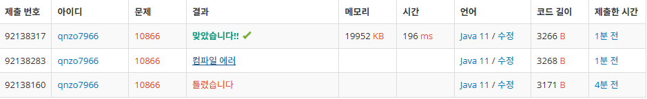

### 📌 **사용 언어** : Java

---

### 📌 **문제 정보**

https://www.acmicpc.net/problem/10866

문제
정수를 저장하는 덱(Deque)를 구현한 다음, 입력으로 주어지는 명령을 처리하는 프로그램을 작성하시오.

명령은 총 여덟 가지이다.

push_front X: 정수 X를 덱의 앞에 넣는다.
push_back X: 정수 X를 덱의 뒤에 넣는다.
pop_front: 덱의 가장 앞에 있는 수를 빼고, 그 수를 출력한다. 만약, 덱에 들어있는 정수가 없는 경우에는 -1을 출력한다.
pop_back: 덱의 가장 뒤에 있는 수를 빼고, 그 수를 출력한다. 만약, 덱에 들어있는 정수가 없는 경우에는 -1을 출력한다.
size: 덱에 들어있는 정수의 개수를 출력한다.
empty: 덱이 비어있으면 1을, 아니면 0을 출력한다.
front: 덱의 가장 앞에 있는 정수를 출력한다. 만약 덱에 들어있는 정수가 없는 경우에는 -1을 출력한다.
back: 덱의 가장 뒤에 있는 정수를 출력한다. 만약 덱에 들어있는 정수가 없는 경우에는 -1을 출력한다.

---

### 📌 **소스 코드 (성공 사례)**

```java

import java.io.*;
import java.util.*;


public class BS_10866 {
    static BufferedReader br = new BufferedReader(new InputStreamReader(System.in));
    static BufferedWriter bw = new BufferedWriter(new OutputStreamWriter(System.out));
    static StringTokenizer st;

    // 모든 숫자 출력에 대한 것을 여기서 처리하도록 함수 빼기
    public static void printNum(int num) throws IOException{
        bw.write(num + "\n");
    }

    //main
    public static void main(String[] args) throws IOException{
        // 덱 생성
        Deque<Integer> deque = new LinkedList<>();

        // 여기서 명령어 얼만큼 적을 건지 숫자 입력
        int n = Integer.parseInt(br.readLine());
        // 그만큼 반복하면서
        for( int i = 0; i < n; i++){

            // 여기서 부터 명령어 입력 들어가는 거임!
            // br.readLine()은 한줄 전체를 통째로 입력 받음!
            st= new StringTokenizer(br.readLine());
            // nextToken을 통해 처음에 나오는 단어를 가져감!
            // ex) push_front 2 이렇게 띄어써져있으면 push_front만 쏙 빼서 넣음
            String command = st.nextToken();

            // push_back과 push_front는 뒤에 숫자가 같이 옴!
            // 그렇기에 뒤에따라오는 st안의 값을 한번 더 nextToken으로 숫자를 가져와서
            // deque에 앞과 뒤에 넣는다!
            if(command.equals("push_back")){
                int num = Integer.parseInt(st.nextToken());
                deque.offerLast(num);
            }
            else if(command.equals("push_front")){
                int num = Integer.parseInt(st.nextToken());
                deque.offerFirst(num);
            }

            // pop_front, pop_back은 덱에 들어있는 값이 없으면 -1 출력
            // 있으면 앞에서 또는 뒤에서 첫 번째로 있는 값 출력
            else if(command.equals("pop_front")){
                if(!deque.isEmpty()) printNum(deque.pollFirst());
                else printNum(-1);
            }
            else if(command.equals("pop_back")){
                if(!deque.isEmpty()) printNum(deque.pollLast());
                else printNum(-1);
            }
            // size는 말그대로 정수 개수 반환
            else if(command.equals("size")){
                printNum(deque.size());
            }
            // empty는 비어있는지 아닌지 확인 해줌
            else if(command.equals("empty")){
                if(!deque.isEmpty()){
                    printNum(0);
                }
                else printNum(1);
            }
            // 그냥 front와 back은 숫자 꺼내지 않고 그냥 숫자 출력!
            // 그래서 peek~~ 사용
            // 마찬가지로 없으면 -1
            else if(command.equals("front")){
                if(!deque.isEmpty()) printNum(deque.peekFirst());
                else printNum(-1);
            }
            else if(command.equals("back")){
                if(!deque.isEmpty()) printNum(deque.peekLast());
                else printNum(-1);
            }
        }

        bw.flush();  // 출력 버퍼 비우기
        bw.close();  // BufferedWriter 닫기
    }
}

java
```

---

### 📌 **메모리 & 소요 시간**



---

### 📌 **시간 복잡도**

- O(n)

---

### 📌 **알고리즘 설명**

- 우선 java에서 지원해주는 Deque를 사용했습니다.
- BufferedWriter랑 BufferedReader를 사용하여 메모리 절약!

---

### 📌 **실패 사례 코드**

```java

import java.io.*;
import java.util.*;


public class BS_10866 {
    static BufferedReader br = new BufferedReader(new InputStreamReader(System.in));
    static BufferedWriter bw = new BufferedWriter(new OutputStreamWriter(System.out));
    static StringTokenizer st;

    // 모든 숫자 출력에 대한 것을 여기서 처리하도록 함수 빼기
    public static void printNum(int num) throws IOException{
        bw.write(num + "\n");
    }

    //main
    public static void main(String[] args) throws IOException{
        // 덱 생성
        Deque<Integer> deque = new LinkedList<>();

        // 여기서 명령어 얼만큼 적을 건지 숫자 입력
        int n = Integer.parseInt(br.readLine());
        // 그만큼 반복하면서
        for( int i = 0; i < n; i++){

            // 여기서 부터 명령어 입력 들어가는 거임!
            // br.readLine()은 한줄 전체를 통째로 입력 받음!
            st= new StringTokenizer(br.readLine());
            // nextToken을 통해 처음에 나오는 단어를 가져감!
            // ex) push_front 2 이렇게 띄어써져있으면 push_front만 쏙 빼서 넣음
            String command = st.nextToken();

            // push_back과 push_front는 뒤에 숫자가 같이 옴!
            // 그렇기에 뒤에따라오는 st안의 값을 한번 더 nextToken으로 숫자를 가져와서
            // deque에 앞과 뒤에 넣는다!
            if(command.equals("push_back")){
                int num = Integer.parseInt(st.nextToken());
                deque.offerLast(num);
            }
            else if(command.equals("push_front")){
                int num = Integer.parseInt(st.nextToken());
                deque.offerFirst(num);
            }

            // pop_front, pop_back은 덱에 들어있는 값이 없으면 -1 출력
            // 있으면 앞에서 또는 뒤에서 첫 번째로 있는 값 출력
            else if(command.equals("pop_front")){
                if(!deque.isEmpty()) printNum(deque.pollFirst());
                else printNum(-1);
            }
            else if(command.equals("pop_back")){
                if(!deque.isEmpty()) printNum(deque.pollLast());
                else printNum(-1);
            }
            // size는 말그대로 정수 개수 반환
            else if(command.equals("size")){
                printNum(deque.size());
            }
            // empty는 비어있는지 아닌지 확인 해줌
            else if(command.equals("empty")){
                if(!deque.isEmpty()){
                    printNum(0);
                }
                else printNum(1);
            }
            // 그냥 front와 back은 숫자 꺼내지 않고 그냥 숫자 출력!
            // 그래서 peek~~ 사용
            // 마찬가지로 없으면 -1
            else if(command.equals("front")){
                if(!deque.isEmpty()) printNum(deque.peekFirst());
                else printNum(-1);
            }
            else if(command.equals("back")){
                if(!deque.isEmpty()) printNum(deque.peekLast());
                else printNum(-1);
            }
        }
    }
}

java
// 여기도 코드 작성 (필수 X)

```

---

### 📌 **실패 이유 및 배운 점**

- bw.flush(); // 출력 버퍼 비우기
  bw.close(); // BufferedWriter 닫기
- 위의 두 문장을 입력하지 않았습니다! ㅠㅜ
- bw에 제가 출력할 내용들을 모아놓았다면 flush로 배출해야한다는 것을 알았습니다!

---

### 📌 **얻어갈 점**

✅ **명확한 조건식 설계의 중요성**

- 명령어들을 문자 비교이기 때문에 equals를 통해 비교하도록 설계
- 뒤에 숫자가 오는 경우에는 st.nextToken을 활용하여 띄어쓰기에 따라 분리 되는 숫자를 가져와서 push 값을 넣어줬습니다!

---

## ✅ 개선 사항

- 개선이라기 보단 저번 1주차에서 사용하지 않았던 Buffer관련과 출력 함수를 따로 빼서
  구현 해보았습니다!

## ✅ 개선 코드
