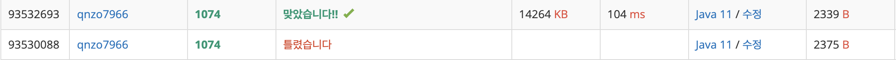

### 📌 **사용 언어** : Java 

---
### 📌 **문제 정보**

https://www.acmicpc.net/problem/1074

문제
한수는 크기가 2N × 2N인 2차원 배열을 Z모양으로 탐색하려고 한다. 예를 들어, 2×2배열을 왼쪽 위칸, 오른쪽 위칸, 왼쪽 아래칸, 오른쪽 아래칸 순서대로 방문하면 Z모양이다.


N > 1인 경우, 배열을 크기가 2N-1 × 2N-1로 4등분 한 후에 재귀적으로 순서대로 방문한다.

다음 예는 22 × 22 크기의 배열을 방문한 순서이다.


N이 주어졌을 때, r행 c열을 몇 번째로 방문하는지 출력하는 프로그램을 작성하시오.

다음은 N=3일 때의 예이다.


입력
첫째 줄에 정수 N, r, c가 주어진다.

출력
r행 c열을 몇 번째로 방문했는지 출력한다.

제한
1 ≤ N ≤ 15
0 ≤ r, c < 2N
예제 입력 1 
2 3 1
예제 출력 1 
11
예제 입력 2 
3 7 7
예제 출력 2 
63

---

### 📌 **소스 코드 (성공 사례)**

```java


import java.io.*;
import java.util.*;

public class BS_1074 {
    // N이 1일 때, 
    // 0,0 0,1 1,0 1,1
    
    // 사분면으로 나눠서 풀어볼 것
    // 정사각형으로 가니까 일단 N 값이 1,2,3 -> 2x2, 4x4, 8x8
    // 그럼 가로 세로 하나당 2, 4, 8 임 이걸로 2로 나누면 가로 세로 딱 중간이기 때문에
    // 어느 사분면에 내 r,c가 포함하는지 알 수 있음
    // 그러면 나눈 그 사분면 안에서 계속 r, c가 포함되면 + 1하고 계속 재귀
    static int N; static int R; static int C;
    static int count = 0;
    public static void countZ(int n, int r, int c){
        if(n == 1){
            System.out.println(count);
            return;
        }
        int half = n / 2;
        // 이러면 크기가 지금 N이 1이라고 생각했을 때 n은 2가 되기에
        // 4 / 4 = 1이 된다 이렇게 사분면을 기준으로 해서 하면 될거 같음
        // count = (n * n) / 4; -> 1사분면 0 2사분면은 1 3사분면은 * 3 4사분면은 * 2
        // R, C가 지금 일단 사분면 어디에 들어가는지를 봐야하니까 기준을 half로 나눴으니 좌우 상하
        // 크기가 2 x 2면 half = 1 이니까 
        // 1,1 1사분면에 가야함 근데 half >= 로 둘 다 비교하는 순간 이상한 곳으로 감


        // 1사분면
    if (r < half && c < half) {
        countZ(half, r, c);
    }
    // 2사분면
    else if (r < half && c >= half) {
        count += half * half;
        countZ(half, r, c - half);
    }
    // 3사분면
    else if (r >= half && c < half) {
        count += half * half * 2;
        countZ(half, r - half, c);
    }
    // 4사분면
    else {
        count += half * half * 3;
        countZ(half, r - half, c - half);
    }
    }
    public static void main(String[] args) throws IOException{
        ///첫째 줄에 정수 N, r, c가 주어진다.
        //r행 c열을 몇 번째로 방문했는지 출력한다.
        BufferedReader br = new BufferedReader(new InputStreamReader(System.in));
        StringTokenizer st ;
        st = new StringTokenizer(br.readLine());

        N = Integer.parseInt(st.nextToken());
        R = Integer.parseInt(st.nextToken());
        C = Integer.parseInt(st.nextToken());

        countZ((int)Math.pow(2,N), R, C);
    }
}
```

---
### 📌 **메모리 & 소요 시간**




---
### 📌 **시간 복잡도**

재귀 호출 횟수는 O(log N) 

---

### 📌 **알고리즘 설명**

- 단순히 범위를 나누기만 하는 것이 아니라 방향까지 고려해야 했음
- 그래서 1,2,3,4 사분면을 생각하여 문제를 풀었음
- 우선 4등분 (즉, 가로 1/2 세로 1/2) 크기를 나누고 나서 왼쪽 위, 오른쪽 위 왼쪽 아래, 오른쪽 아래 이렇게 가도록 해야함
- 점점 나누다 보면 크기가 1일때까지 가게 되면 count ++ 하도록 하고 그전까지는 재귀를 통해 좌표를 점점 나눈 크기만큼 z자로 움직이도록 해서
범위를 바꿔가며 이동하도록 했음!
- 이렇게 반복하면 완성!

---

### 📌 **실패 사례 코드**

```java
import java.io.*;
import java.util.*;

public class Main {
    // N이 1일 때, 
    // 0,0 0,1 1,0 1,1
    
    // 사분면으로 나눠서 풀어볼 것
    // 정사각형으로 가니까 일단 N 값이 1,2,3 -> 2x2, 4x4, 8x8
    // 그럼 가로 세로 하나당 2, 4, 8 임 이걸로 2로 나누면 가로 세로 딱 중간이기 때문에
    // 어느 사분면에 내 r,c가 포함하는지 알 수 있음
    // 그러면 나눈 그 사분면 안에서 계속 r, c가 포함되면 + 1하고 계속 재귀
    static int N; static int R; static int C;
    static int count = 0;
    public static void countZ(int n, int r, int c){
        if(n == 1){
            System.out.println(count);
            return;
        }
        
        int half = n / 2;

        // 이러면 크기가 지금 N이 1이라고 생각했을 때 n은 2가 되기에
        // 4 / 4 = 1이 된다 이렇게 사분면을 기준으로 해서 하면 될거 같음
        // count = (n * n) / 4; -> 1사분면 0 2사분면은 1 3사분면은 * 3 4사분면은 * 2
        // R, C가 지금 일단 사분면 어디에 들어가는지를 봐야하니까 기준을 half로 나눴으니 좌우 상하
        // 크기가 2 x 2면 half = 1 이니까 
        // 1사분면 0 < R < half C < half
        if(c < half && r < half){
            countZ(half, r, c);
        }
        // 2사분면 R > half C < half
        else if(c >= half && r < half){
            count += (n * n) / 4;
            countZ(half, r, c);
        }
        // 4 사분면  r<half c >= half
        else if(c < half && r >= half){
            count += (n*n) / 4 * 2;
            countZ(half, r, c);
        }
        // 3 사분면 R >= half c >= half
        else if(c >= half && r >= half){
            count += (n*n) / 4 * 3;
            countZ(half, r, c);
        }
    }
    public static void main(String[] args) throws IOException{
        ///첫째 줄에 정수 N, r, c가 주어진다.
        //r행 c열을 몇 번째로 방문했는지 출력한다.
        BufferedReader br = new BufferedReader(new InputStreamReader(System.in));
        StringTokenizer st ;
        st = new StringTokenizer(br.readLine());

        N = Integer.parseInt(st.nextToken());
        R = Integer.parseInt(st.nextToken());
        C = Integer.parseInt(st.nextToken());

        countZ((int)Math.pow(2,N), R, C);
    }
}


```

---

### 📌 **실패 이유 및 배운 점**

- 처음에 크기만 나누면 될 줄 알았는데 생각해보니까 좌표 움직임까지 고려를 못해서 틀렸어요 ㅠㅜ
- 범위를 이동하면서 더 세부적인 내용까지 고려하면서 문제를 풀어보겠습니다!

---

### 📌 **얻어갈 점**

- 조건 잘걸기
- 재귀할 변수들 잘 생각하기

---

