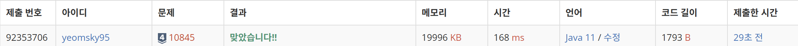

### 📌 **사용 언어** : Java

---
### 📌 **문제 정보 **
https://www.acmicpc.net/problem/10845
문제
정수를 저장하는 큐를 구현한 다음, 입력으로 주어지는 명령을 처리하는 프로그램을 작성하시오.

명령은 총 여섯 가지이다.

push X: 정수 X를 큐에 넣는 연산이다.
pop: 큐에서 가장 앞에 있는 정수를 빼고, 그 수를 출력한다. 만약 큐에 들어있는 정수가 없는 경우에는 -1을 출력한다.
size: 큐에 들어있는 정수의 개수를 출력한다.
empty: 큐가 비어있으면 1, 아니면 0을 출력한다.
front: 큐의 가장 앞에 있는 정수를 출력한다. 만약 큐에 들어있는 정수가 없는 경우에는 -1을 출력한다.
back: 큐의 가장 뒤에 있는 정수를 출력한다. 만약 큐에 들어있는 정수가 없는 경우에는 -1을 출력한다.

입력
첫째 줄에 주어지는 명령의 수 N (1 ≤ N ≤ 10,000)이 주어진다. 둘째 줄부터 N개의 줄에는 명령이 하나씩 주어진다. 주어지는 정수는 1보다 크거나 같고, 100,000보다 작거나 같다. 문제에 나와있지 않은 명령이 주어지는 경우는 없다.
---
### 📌 **소스 코드 (성공 사례)**

```java
java

import java.io.*;
import java.util.*;

public class W10845My {
    public static void main(String[] args) throws IOException {
        BufferedReader br = new BufferedReader(new InputStreamReader(System.in));//버퍼리더 br선언
        int N = Integer.parseInt(br.readLine());//명령의 수 받아들여오는 N 선언
        StringBuilder sb = new StringBuilder();//추후 String 받아들여오는 sb 선언언
        Queue<Integer> que = new LinkedList<Integer>();//QUE 선언
        int num = 0;

        for (int i = 0; i < N; i++) {
            StringTokenizer st = new StringTokenizer(br.readLine());
            String S = st.nextToken();//push, pop, size, empty, front 입력을 받아들여오기기

            switch (S) {
                case "push":
                    num = Integer.parseInt(st.nextToken());
                    que.offer(num);
                    break;
                case "pop":
                    if (que.isEmpty())
                        sb.append(-1).append("\n");
                    else
                        sb.append(que.poll()).append("\n");
                    break;
                case "size":
                    sb.append(que.size()).append("\n");
                    break;
                case "empty":
                    if (que.isEmpty())
                        sb.append(1).append("\n");
                    else
                        sb.append(0).append("\n");
                    break;
                case "front":
                    if (que.isEmpty())
                        sb.append(-1).append("\n");
                    else
                        sb.append(que.peek()).append("\n");
                    break;

                case "back":
                    if (que.isEmpty())
                        sb.append(-1).append("\n");
                    else
                        sb.append(num).append("\n");
                    break;
            }
        }
        System.out.println(sb);
    }
}


```

---

### 📌 **시간 복잡도**

- O(n)

---

### 📌 **알고리즘 설명**

- Que를 처음에 받아오는 명령의 수 N만큼 생성한 후 Switch Case를 이용해서 들어오는 
단어의 요구에 따라 움직이게 했습니다

---

### 📌 **실패 사례 코드**

### 📌 **실패 이유 및 배운 점**

- ex ~~~
- ex ~~~
- ex ~~~

---
### 📌 **메모리&소요시간**

---
### 📌 **얻어갈 점**

✅ **명확한 조건식 설계의 중요성**

- ex ~~~
- ex ~~~

---

## ✅ 개선 사항

- ex ~~~
- ex ~~~
- ex ~~~

## ✅ 개선 코드

- ex ~~~
- ex ~~~
- ex ~~~
