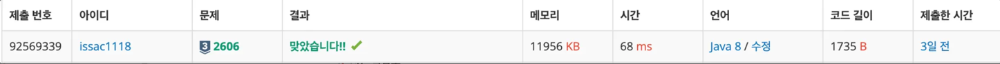
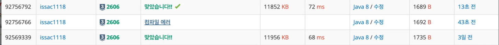

**📌 사용 언어 : Java**

---

**📌 문제 정보**

https://www.acmicpc.net/problem/2606

신종 바이러스인 웜 바이러스는 네트워크를 통해 전파된다. 한 컴퓨터가 웜 바이러스에 걸리면 그 컴퓨터와 네트워크 상에서 연결되어 있는 모든 컴퓨터는 웜 바이러스에 걸리게 된다.

예를 들어 7대의 컴퓨터가 네트워크 상에서 연결되어 있다고 하자. 1번 컴퓨터가 웜 바이러스에 걸리면 웜 바이러스는 2번과 5번 컴퓨터를 거쳐 3번과 6번 컴퓨터까지 전파되어 2, 3, 5, 6 네 대의 컴퓨터는 웜 바이러스에 걸리게 된다. 하지만 4번과 7번 컴퓨터는 1번 컴퓨터와 네트워크상에서 연결되어 있지 않기 때문에 영향을 받지 않는다.

어느 날 1번 컴퓨터가 웜 바이러스에 걸렸다. 컴퓨터의 수와 네트워크 상에서 서로 연결되어 있는 정보가 주어질 때, 1번 컴퓨터를 통해 웜 바이러스에 걸리게 되는 컴퓨터의 수를 출력하는 프로그램을 작성하시오.

---

**📌 소스 코드 (성공 사례)**

```java
import java.util.*;
import java.io.*;
public class HJ_2606 {
    public static int[][] coms;
    public static boolean[] visited;
    public static int N, T;

    public static void bfs(int start) {
        Deque<Integer> deque = new ArrayDeque<>();
        deque.addLast(start);
        visited[start] = true;

        while(!deque.isEmpty()) {
            int curr = deque.pollFirst();
            for(int i = 0; i < N; i++) {
                if(coms[curr][i] == 1 && !visited[i]) {
                    visited[i] = true;
                    deque.addLast(i);
                }
            }
        }
    }
    public static void main(String[] args) throws IOException{
        BufferedReader br = new BufferedReader(new InputStreamReader(System.in));
        BufferedWriter bw = new BufferedWriter(new OutputStreamWriter(System.out));
        StringBuilder sb = new StringBuilder();

        //환경기본세팅
        N = Integer.parseInt(br.readLine());
        T = Integer.parseInt(br.readLine());
        coms = new int[N][N]; //컴퓨터수 100이하 -> 100 x 100 = 10,000 배열크기 충분
        visited = new boolean[N];
        for(int i = 0; i < T; i++) {
            StringTokenizer st = new StringTokenizer(br.readLine());
            int x = Integer.parseInt(st.nextToken()) - 1;
            int y = Integer.parseInt(st.nextToken()) - 1;
            coms[x][y] = 1;
            coms[y][x] = 1;
        }

        bfs(0);
        int sum = -1; //1번 자신은 빼고 집계
        for(int i = 0; i < N; i++) {
            if(visited[i]) sum++;
        }

        br.close();
        bw.write(sb.append(String.valueOf(sum)).toString()); //1번 자신은 빼고 집계
        bw.flush();
        bw.close();
    }
}

```

---

**📌 메모리 & 소요 시간**



---

**📌 시간 복잡도**

- 컴퓨터 수 N (1 ≤ N ≤ 100)
- 연결된 컴퓨터 쌍의 수 M (1 ≤ M ≤ N×(N-1)/2)
- **그래프 탐색 (DFS/BFS)**:
    - 각 노드를 한 번씩 방문: **O(N)**
    - 각 간선을 한 번씩 방문: **O(M)**

**→ 전체 시간복잡도는 O(N + M) ⇒ O(100 + 4950) = O(5050) 충분!!!**

---

**📌 알고리즘 설명**

- 배열을 이용한 BFS 구현 → 일반적인 BFS구현과 동일
- 1번 컴퓨터랑만 연결된 컴퓨터들을 찾기 때문에 BFS(1)

---

**📌 실패 사례 코드**

```
-
```

---

**📌 실패 이유 및 배운 점**

- -

---

**📌 얻어갈 점**

✅ **명확한 조건식 설계의 중요성**

- 연결된 컴퓨터의 수를 구할때, 자기 자신은 빼고 집계
- 인접리스트로 구현시 성능 파악 필요
- static 변수 설정의 중요성

---

**✅ 개선 사항**

- 인접 리스트로 구현시 성능비교

**✅ 개선 코드**

```java
import java.util.*;
import java.io.*;

public class HJ_2606 {
    public static List<List<Integer>> coms;
    public static boolean[] visited;
    public static int N, T;

    public static void bfs(int start) {
        Deque<Integer> deque = new ArrayDeque<>();
        deque.addLast(start);
        visited[start] = true;

        while(!deque.isEmpty()) {
            int curr = deque.pollFirst();
            for (int next : coms.get(curr)) {
                if (!visited[next]) {
                    visited[next] = true;
                    deque.addLast(next);
                }
            }
        }
    }

    public static void main(String[] args) throws IOException {
        BufferedReader br = new BufferedReader(new InputStreamReader(System.in));
        BufferedWriter bw = new BufferedWriter(new OutputStreamWriter(System.out));
        StringBuilder sb = new StringBuilder();

        N = Integer.parseInt(br.readLine());
        T = Integer.parseInt(br.readLine());
        visited = new boolean[N];

        coms = new ArrayList<>();
        for (int i = 0; i < N; i++) {
            coms.add(new ArrayList<>());
        }

        for (int i = 0; i < T; i++) {
            StringTokenizer st = new StringTokenizer(br.readLine());
            int x = Integer.parseInt(st.nextToken()) - 1;
            int y = Integer.parseInt(st.nextToken()) - 1;
            coms.get(x).add(y);
            coms.get(y).add(x);
        }

        bfs(0);

        int sum = -1; // 자기 자신 제외
        for (boolean v : visited) {
            if (v) sum++;
        }

        br.close();
        bw.write(sb.append(sum).toString());
        bw.flush();
        bw.close();
    }
}
```



→ LinkedList 와 Array의 성능 거의 동일!!